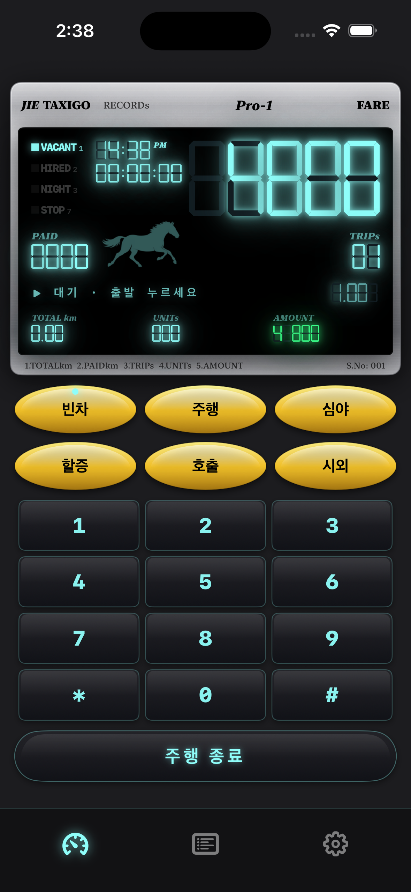
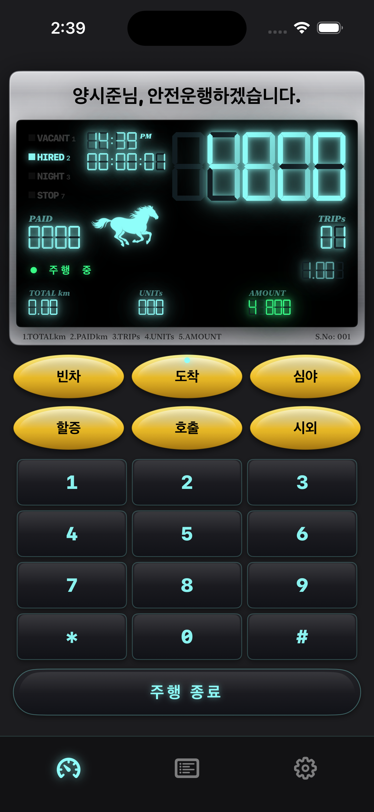
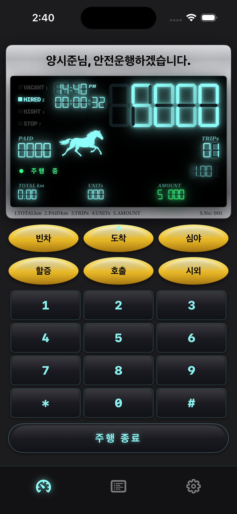
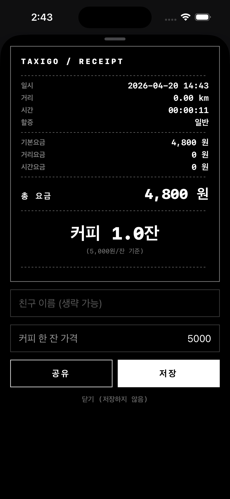
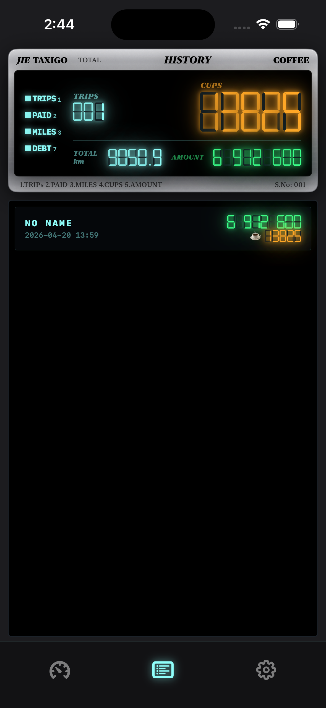
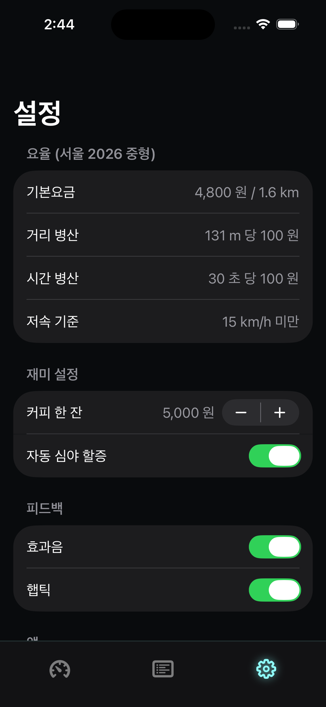

# 🚕 TaxiGo

> 친구들아, 오늘 달린 거 커피 ○잔이다.
>
> A Korean‑style retro taxi meter for the friends who keep asking for rides.
> A vibe‑coded iOS app for collecting coffee debts.


---

## 왜 만들었나

친구들 카풀을 너무 많이 해줬다. 그래서 **택시 미터기 앱**을 하나 만들었다.
이제 친구를 차에 태울 때마다:

1. 주행 버튼을 누르면
2. 한국식 레트로 VFD 미터기가 요금을 쌓고
3. 도착 버튼을 누르면 영수증이 튀어나오는데
4. 요금이 **"커피 2.3잔"** 이라고 번역돼서 나온다

미안함 → 커피 한 잔. 간단하고 효율적인 경제 생태계.

기술적으로 정교한 앱은 아니다. 1990년대 한국 택시에 달려 있던
**JIE JOONGANG Pro‑1** 미터기의 감성을 iPhone 화면에 다시 보고 싶어서 만든
바이브코딩 프로젝트다.

---

## Screenshots

| | | |
|:---:|:---:|:---:|
| 대기 (VACANT) | 주행 중 + 인사말 | 주행 경과 |
|  |  |  |
| **흑백 영수증** | **이력 (Pro‑1 스타일)** | **설정** |
|  |  |  |

---

## What it does

### 미터 화면 (Pro‑1 재현)
- **실버 메탈 베젤** — 다층 그라디언트 + Canvas 브러시 스트라이에
- **시안 VFD 7‑세그먼트** — 육각 바 세그먼트를 직접 Canvas로 드로우 (폰트 파일 無)
- **좌측 수직 인디케이터** — `VACANT₁ / HIRED₂ / NIGHT₃ / STOP₇` with subscript
- **도트 매트릭스 말** — 번들된 template PNG 2프레임 2 Hz 갤롭
- 센터: 시계(AM/PM) · 경과 시간 · 거대 **FARE** · PAID · TRIPs · 할증 배율 · TOTAL km · UNITs · AMOUNT

### 인사말 헤더
- 주행 버튼 → 손님 이름 프롬프트
- 입력하면 베젤 헤더가 **"○○○님, 안전운행하겠습니다."** 로 변경
- 주행 종료 시 기본 `JIE TAXIGO · Pro‑1 · FARE` 헤더로 복귀

### 물리 버튼 (3 · 3 · 1 배치)
- Ellipse 타원 pill 버튼 — 노란 주황 그라디언트에 상단 광택 하이라이트
- 1행: 빈차 · **주행/도착** · 심야
- 2행: 할증 · 호출 · 시외
- 3행: **주행 종료** (Capsule, 검정 + 시안 글로우)

### 숫자 키패드 (4 × 3)
- 1–9 · `*` · 0 · `#` — Pro‑1 우측 키패드 재현
- `*` = 백스페이스, `#` = 클리어
- 키 누를 때 tick 사운드 + 햅틱

### 커스텀 탭바
- iOS TabView 제거, 직접 만듦
- 아이콘만 (라벨 없음), 활성 탭 시안 글로우
- 탭 전환 시 페이드/애니메이션 일체 없음

### 영수증 (흑백 미니멀)
- 일시 · 거리 · 시간 · 할증 · 기본/거리/시간 요금 · **총 요금** · **커피 N.잔**
- 점선 divider로 실제 영수증 질감
- 공유(검정) / 저장(흰색) 버튼 — 각진 사각형
- `ImageRenderer` → `UIActivityViewController` 로 카톡/인스타 공유

### 이력 (Pro‑1 누적 패널)
- 베젤 + `HISTORY / COFFEE` 헤더
- `TRIPS / PAID / MILES / DEBT` 인디케이터
- 누적 **CUPS 7‑seg 대형** · TOTAL km · AMOUNT
- Trip 리스트 카드 (시안 이름 + 초록 금액 + 오렌지 커피잔수)

---

## How it works

```
┌─────────────────────────────┐
│   MeterViewModel (@Observable)│
│   · elapsed, state machine   │
│   · timer @ 4 Hz             │
└───────────────┬──────────────┘
                ▼  rule.timeBasedFare(elapsed:)
┌───────────────┴──────────────┐
│       FareRule (seoul 2026)  │
│   · base 4,800 for 20 s      │
│   · +100 per 5 s after       │
│   · 심야 할증 × 1.20/1.40    │
└───────────────┬──────────────┘
                ▼  FareBreakdown
┌───────────────┴──────────────┐
│   SwiftUI Pro‑1 meter face   │
│   + SwiftData `Trip` persistence │
└──────────────────────────────┘
```

- **시간 기반 과금.** GPS 비활성 — 실제 주행 거리가 아니라 탑승 시간으로 과금.
  친구를 태운 시간만큼 올라가서 "시간 낭비 값" 개념이 된다.
- **순수 함수 계산 엔진.** `FareRule.timeBasedFare(elapsed:)` 는 상태 없음, 테스트 가능.
- **모든 그래픽이 코드.** 7‑segment · 베젤 · 말 애니메이션 · 키패드 — 전부 SwiftUI Canvas/Shape.
  외부 디자인 애셋은 말 그림 2프레임 PNG뿐.
- **저장은 SwiftData.** `Trip` 모델이 요금·거리·시간·친구 이름·커피 단가 영속화.

---

## Build

```bash
brew install xcodegen
git clone <this repo>
cd taxigo

make project   # project.yml → TaxiGo.xcodeproj
make build     # Debug build for iPhone 16 simulator
make test      # 14 unit tests (FareCalculator + SurchargeClock)
make run       # build + install + launch on booted simulator
```

- Xcode 26+, iOS 17 deploy target
- 외부 dependency 없음 (XcodeGen은 build‑time 툴)
- `.xcodeproj` 는 `project.yml` 에서 생성되며 gitignore됨

### Project layout

```
Sources/TaxiGo/
├── App/            @main, RootView + 커스텀 탭바 스위치
├── Models/         FareRule · SurchargeMode · MeterState · Trip · MeterTick
├── Services/       FareCalculator · SurchargeClock · LocationService
│                   · SoundPlayer · HapticEngine
├── ViewModels/     MeterViewModel (@Observable @MainActor)
├── Views/          MeterView · ReceiptView · HistoryView · SettingsView
│                   · MeterDisplay · IndicatorBar · RunningHorseView
│                   · NumberKeypad · CustomTabBar · DesignSystem
└── Resources/      Info.plist · Assets.xcassets (AppIcon + Horse1/Horse2)
Tests/TaxiGoTests/  FareCalculator · SurchargeClock tests
```

---

## Privacy / Permissions

- 위치 권한은 **요청하지 않음** (시간 기반 과금이라 GPS 불필요).
- 마이크 · 카메라 · 알림 · 없음.
- 서버 · 계정 · 분석 · 없음 — 완전 로컬.
- 영수증 공유는 유저가 버튼을 누를 때만 `UIActivityViewController` 로.

---

## Status

- [x] Pro‑1 레이아웃 & 실버 베젤
- [x] 시안 VFD 7‑세그먼트 (Canvas 렌더링)
- [x] 도트 매트릭스 말 (2 Hz 갤롭)
- [x] 3·3·1 타원 버튼 + 숫자 키패드 + 주행 종료
- [x] 손님 인사말 프롬프트
- [x] 흑백 미니멀 영수증
- [x] Pro‑1 스타일 이력 뷰
- [x] 커스텀 탭바 (페이드 없음)
- [ ] AppIcon · 커스텀 런치 스크린
- [ ] Live Activities — Dynamic Island 실시간 요금
- [ ] 지역별 요율 프리셋 (부산 · 대전 · 울산)

---

## License

© 2026 Gojaehyeon. 아직 라이선스 결정 전 — 소스는 공개, 커피 청구 기능은 비매품.
